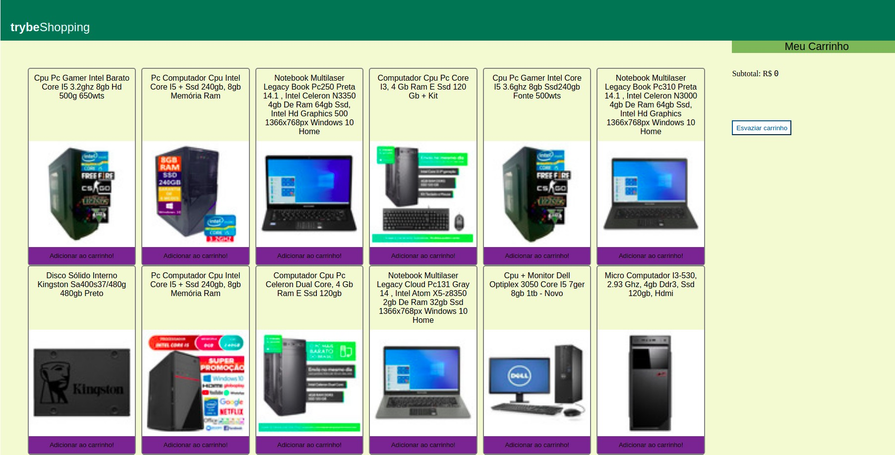

## Project 5 - Fundamentals Module - Shopping cart

---

# Skills and technologies used in this project:

* _HTML 5 
* _CSS 3 
* _JavaScript 

---

## What is the project about?

This project simulates an e-commerce with consumption of an API from Mercado Livre.
Project under development.

---

# Instructions for running the project:

1. Clone the repository
  * `git clone git@github.com:CrisSouzaMA/trybeshoppingcart.git`
  * Entre na pasta do repositório que você acabou de clonar:
    * `cd Projeto-5-Shopping-Cart`

2. Initialize the project
    * `npm start` (a new page should open in your browser with the project)

---

### To-do List:

- [ ] Refactor
- [ ] Responsiveness
- [ ] Adjust cart clear button

Bye 🖐️

